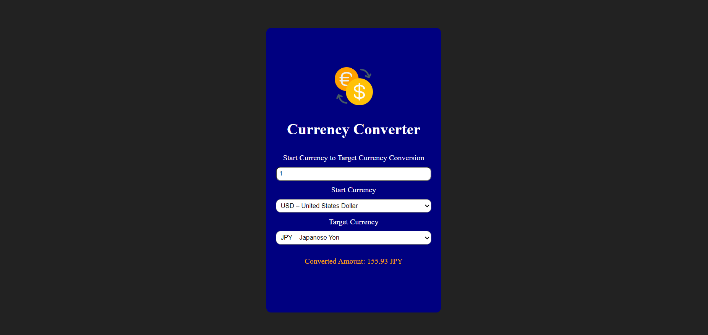

# 💱 Currency Converter (React)

> A real-time currency converter built with React that fetches live exchange rates from an external API and converts between over 150 global currencies instantly.



---

## 👀 Why This Project Stands Out

- Real-time currency conversion using live exchange rate data  
- Supports **150+ international currencies**  
- Clean, intuitive UI with instant feedback  
- Dynamic conversion based on user input and selected currencies  
- Efficient API calls triggered only when base currency changes  
- Built using modern React best practices (hooks & state)  

---

## 🧠 What I Learned

- Working with **React Hooks** (`useState`, `useEffect`)
- Fetching and handling **real-time API data**
- Managing dependent state updates in React
- Handling async operations and error states
- Optimising API calls based on dependency arrays
- Structuring a React app with **Vite**
- Rendering large `<select>` datasets efficiently

> 📌 This project helped me strengthen my understanding of **React fundamentals**, API integration, and real-world state management scenarios.

---

## 🛠️ Tech Stack

- **React** – Component-based UI and state management  
- **Vite** – Fast development environment  
- **JavaScript (ES6+)** – Modern syntax and async logic  
- **ExchangeRate API** – Live currency conversion data  
- **HTML5** – App entry point & metadata  
- **Inline Styling** – Simple, focused UI styling  

---

## ✨ Features

- Live exchange rate fetching based on base currency  
- Convert between **any supported currency pair**  
- Real-time calculation as the user types  
- Clean and minimal UI design  
- Error handling for failed API requests  
- Fully client-side React application  

---

## ⚙️ How to Run Locally

1. Clone the repository  
   ```bash
   git clone https://github.com/FrontEndHighRoller/currency-converter.git
   
2. Install dependencies
    ```bash
    npm install
    
3. Start the development server
    ```bash
    npm run dev
    
4. Open the app in your browser and start converting 💸
